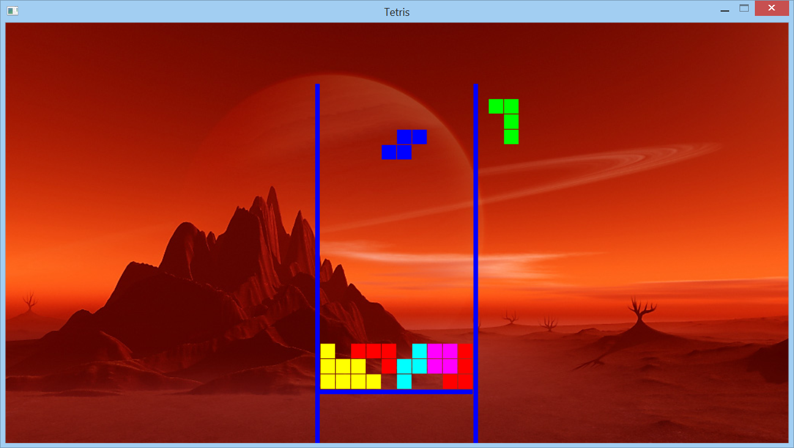

# Tetris 
Tetris game for linux (originally C++ [here](https://github.com/abesary/tetris-linux.git)) to Rust using SDL2 (SDL2 Library included in repository)

Only tested on Ubuntu 18.04.4

You'll need libsdl2-gfx-dev and libsdl2-dev to use SDL on linux. If you are using Ubuntu you can get them this way: 
```
sudo apt-get install libsdl2-dev 
sudo apt-get install libsdl2-gfx-dev
```

Next, clone the repository. Change directory to tetris-linux and run with
```
cargo run
```

### Game Play
arrow keys - move piece

space      - drops piece


#### Screenshot


I'm looking for job opportunities in Rust.
I have 11 years of developer experience, but only 1.5 months in Rust xD
If you're interested, then please send me a message.

